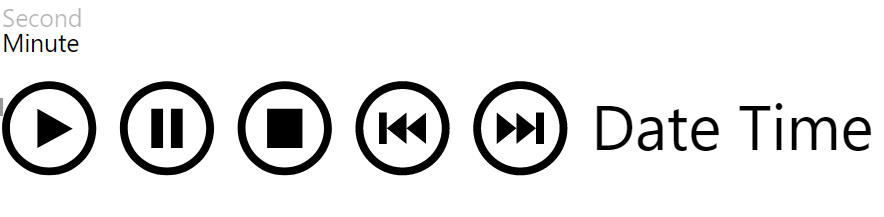

# PlayAxis

Forked version of the [PlayAxis](https://github.com/mprozil/PlayAxis) custom visual. Adding buttons for selecting time-resolution enables the visual to skip values for stepping through the dataset faster. The resolution can be adjusted during playing.

>This project is just used for a demo with a dataset that has a resolution of one value per second. The visual will not adjust itself to datasets with different resolution and will just jump 60 indexes instead of one when minute is selected.

Download packaged visual: [playAxis.pbiviz](https://github.com/KristofferBerge/PlayAxis/raw/master/dist/playAxis.pbiviz)